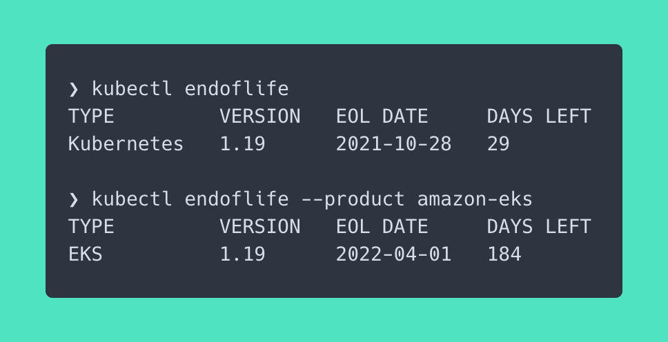

# kubectl-check



A kubectl plugin that checks your clusters for component compatibility and Kubernetes version end of life. This plugin is meant to assess how much time is available before the Kubernetes version is sunsetted in different platforms like EKS

## Quickstart

Building and installing this plugin can be done by cloning this repo and running `make install` like this

```
wget -c https://github.com/rossedman/kubectl-endoflife/releases/download/v0.1.0-alpha/kubectl-endoflife_0.1.0-alpha_darwin_amd64.tar.gz -O kubectl-endoflife.tar.gz
tar -xvf kubectl-endoflife.tar.gz
mv kubectl-endoflife /usr/local/bin/kubectl-endoflife
```

At this point you should be able to run 

```
kubectl endoflife
```

## Commands

### kubectl endoflife

This command will check the end of life date for a version using `endoflife.data` and print how much time is left as well as the end of life data. The default option is to check upstream Kubernetes only:

```shell
❯ kubectl endoflife
TYPE         VERSION   EOL DATE     DAYS LEFT
Kubernetes   1.19      2021-10-28   29
```

To change what product is evaluated, use the `--product` flag

```shell
❯ kubectl endoflife --product amazon-eks
TYPE         VERSION   EOL DATE     DAYS LEFT
EKS          1.19      2022-04-01   184
```

This command also will exit `0` or `1` depending on the flags set. Exiting `1` means the cluster is within a threshold that the user deems expired. Here are some examples below

```shell
❯ kubectl endoflife --product amazon-eks --expiry-range 200
TYPE         VERSION   EOL DATE     DAYS LEFT
amazon-eks   1.19      2022-04-01   177
exit status 1

❯ kubectl endoflife --product amazon-eks --expiry-range 150
TYPE         VERSION   EOL DATE     DAYS LEFT
amazon-eks   1.19      2022-04-01   177
```

In the first example we have set anything less than 200 days to be expired and exit with a `1`. In the second example, we have shortened this timeframe and the command exits with a `0`. This becomes more valuable when we start to script with this command like below

```shell
if ! kubectl endoflife --product amazon-eks --silent --expiry-range 30 ; then 
    echo "starting upgrade now..."
fi
```